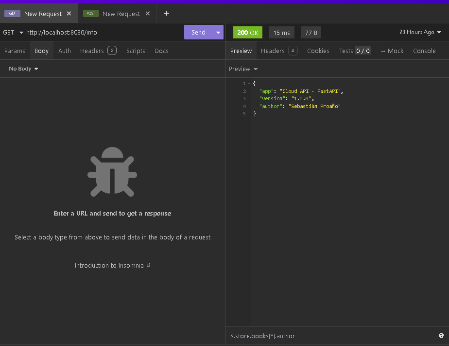
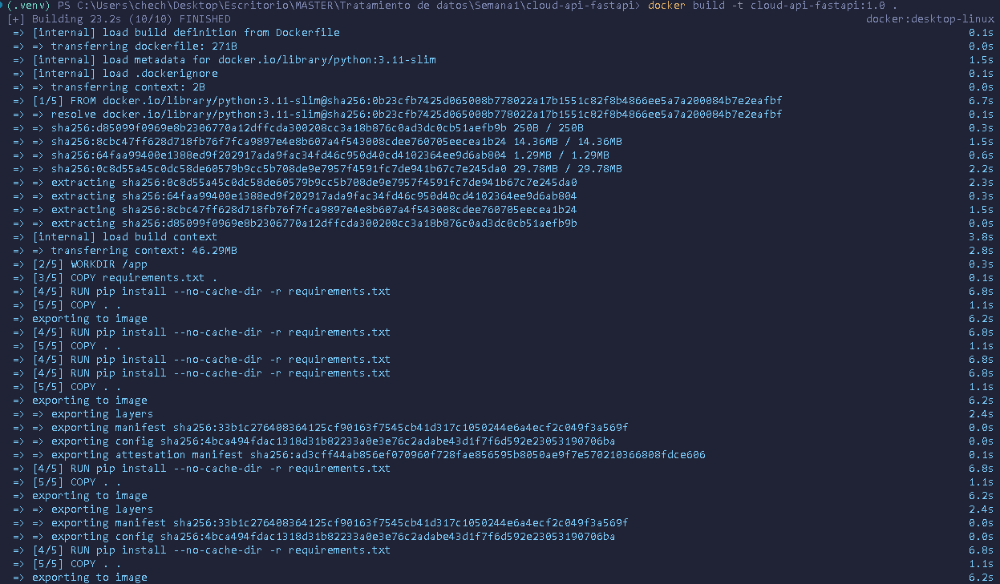
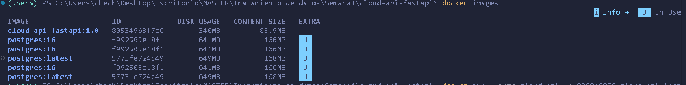
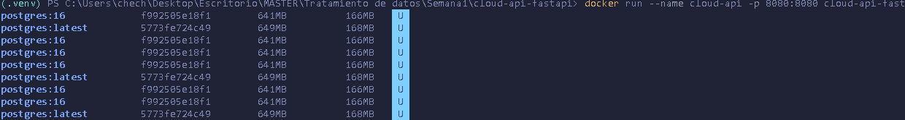
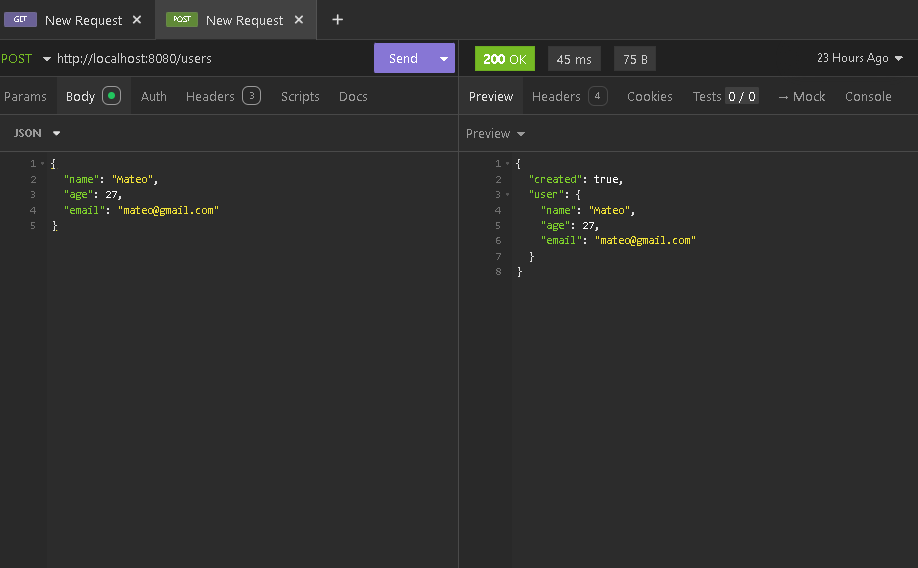
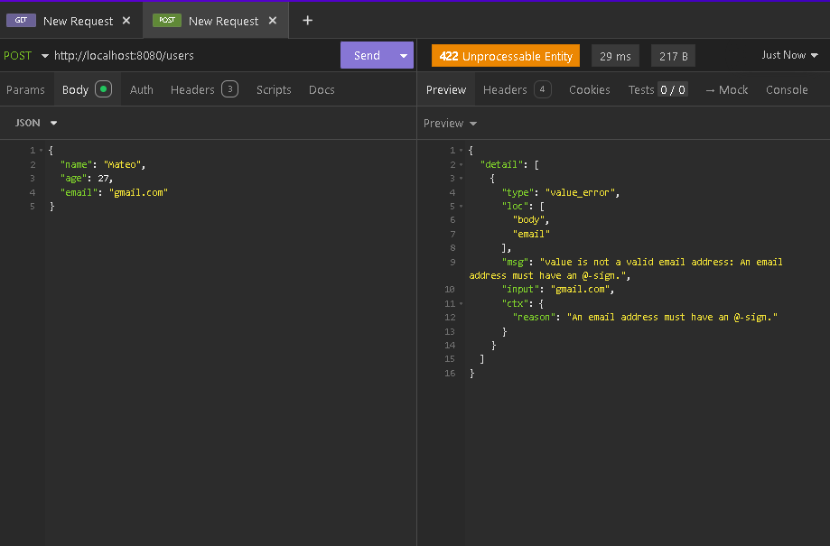

# Cloud API - FastAPI
# GRUPO 10
API desarrollada en FastAPI aplicando buenas prácticas de desarrollo,
versionamiento con Git, contenerización con Docker y pruebas con curl.

------------------------------------------------------------------------

## 🎯 Objetivo

Diseñar, construir y contenerizar un API funcional utilizando:

-   GitHub (control de versiones)
-   Docker (contenerización)
-   curl (pruebas de endpoints)

------------------------------------------------------------------------

## 🛠 Tecnologías

-   Python 3.11\
-   FastAPI\
-   Uvicorn\
-   Pydantic\
-   Docker\
-   Git & GitHub

------------------------------------------------------------------------

## 📦 Estructura del Proyecto

cloud-api-fastapi/ │ ├── app/ │ └── main.py ├── Dockerfile ├──
requirements.txt ├── README.md └── evidencia/

------------------------------------------------------------------------

## 🚀 Funcionalidades

### Endpoints GET

-   /health
-   /info

### Endpoint POST

-   /users

### Validaciones implementadas

-   name: mínimo 2 caracteres\
-   age: entre 0 y 120\
-   email: formato válido

### Respuestas

-   JSON automático\
-   Manejo de errores 422 en validaciones inválidas

------------------------------------------------------------------------

## 🔀 Uso de Branches

Se creó la rama:

feature/info-endpoint

En ella se implementó el endpoint /info y posteriormente se realizó
merge a main.

------------------------------------------------------------------------

## 💻 Ejecutar localmente

python -m venv .venv .venv`\Scripts`{=tex}`\Activate`{=tex}.ps1 pip
install -r requirements.txt python -m uvicorn app.main:app --reload
--port 8080

Acceder a:

-   http://localhost:8080/health\
-   http://localhost:8080/docs

------------------------------------------------------------------------

## 🐳 Docker -- Contenerización

### Construcción de imagen

docker build -t cloud-api-fastapi:1.0 .

### Ver imágenes creadas

docker images

### Ejecutar contenedor

docker run --name cloud-api -p 8080:8080 cloud-api-fastapi:1.0

### Ver contenedor en ejecución

docker ps

------------------------------------------------------------------------

## 🧪 Pruebas con curl

### GET funcionando

curl -i http://localhost:8080/health

### POST funcionando

curl -i -X POST http://localhost:8080/users -H "Content-Type:
application/json" -d
'{"name":"Mateo","age":27,"email":"mateo@test.com"}'

### Manejo de errores (422)

curl -i -X POST http://localhost:8080/users -H "Content-Type:
application/json" -d '{"name":"M","age":27,"email":"no-es-email"}'

------------------------------------------------------------------------

## 📸 Evidencia

### API funcionando localmente

### Construcción de imagen Docker

### Imagen creada

### Contenedor ejecutándose

### Docker ps

### Curl GET

### Curl POST

### Curl Error

------------------------------------------------------------------------

## ☁️ Despliegue en la nube

El proyecto está preparado para desplegarse en Google Cloud Run
mediante:

gcloud run deploy cloud-api-fastapi --source . --region us-central1
--allow-unauthenticated

El despliegue requiere habilitación de facturación (billing).

------------------------------------------------------------------------

## 📌 Conclusión

El API fue:

-   Diseñado\
-   Versionado con Git\
-   Desarrollado con uso de branches\
-   Contenerizado con Docker\
-   Probado con curl\
-   Documentado con evidencia visual
